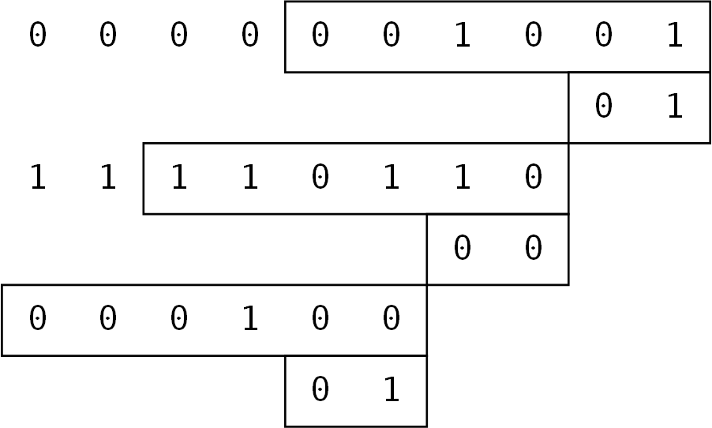
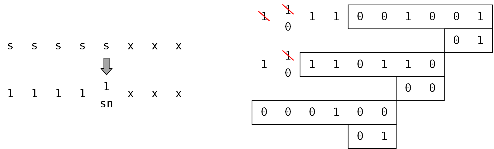
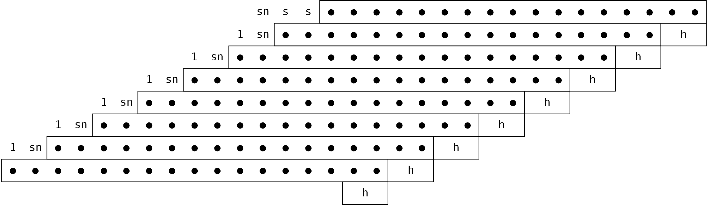
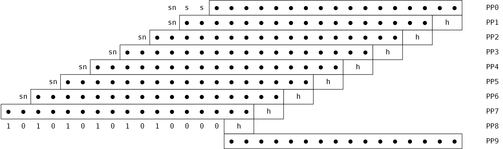

Booth乘法器的Chisel实现
====================
  
本项目为使用Chisel实现的基4-Booth乘法器，其目标是能够生成参数化的乘法器。  
  
## Booth乘法器原理  
  
### 数学表示  
  
对于任意的一个有符号数B，  假设位宽 $n$ 为偶数， $B_{-1}=0$ 

$$B = B_{n-1}  \times (-2)^{n-1} + B_{n-2}  \times 2^{n-2} + \cdots + B_{1}\times 2^{1}+B_{0}\times2^{0} + {B_{-1}}$$

那么将偶数位拆开得到：

$$
\begin{align}
B =&  B_{n-1}  \times (-2)^{n-1} + B_{n-2}  \times 2^{n-2} + \cdots + B_{1}\times 2^{1}+B_{0}\times2^{0} + B_{-1} \\
=& (-2B_{n-1}+B_{n-2}+B_{n-3})\times 2^{n-2} + \\
& (-2B_{n-3} +B_{n-4}+B_{n-5})\times 2^{n-4} + \\
& \cdots + \\
& (-2B_{1}+B_{0}+B_{-1})\times 2^{0} \\
\end{align}
$$

对于任意的数 $A$ ，其与 $B$ 相乘可以变为：

$$
\begin{align}
A\times B =& A\times(-2B_{n-1}+B_{n-2}+B_{n-3})\times 2^{n-2} + \\
& A\times(-2B_{n-3} +B_{n-4}+B_{n-5})\times 2^{n-4} + \\
& \cdots + \\
& A\times(-2B_{1}+B_{0}+B_{-1})\times 2^{0} \\
=& \{A\times(-2B_{n-1}+B_{n-2}+B_{n-3})\} << (n-2) + \\
& \{A\times(-2B_{n-3} +B_{n-4}+B_{n-5})\} << (n-4) + \\
& \cdots + \\
& \{A\times(-2B_{1}+B_{0}+B_{-1})\} << 0 \\ 
\end{align}
$$

将 $PP_{k} = A\times(-2B_{i+1}+B_{i}+B_{i-1})$ 称为部分积，其中 $k = \dfrac{{i}}{2}$ 。
因此乘法就是 $\dfrac{n}{2}$ 个部分积的左移和相加。
相比于传统乘法运算（或基2 Booth），基4 Booth乘法只需要 $\dfrac{n}{2}-1$ 次加法，极大加快了速度。

### 部分积产生

对于任意一个部分积 $PP$ ，其是经过 $A, B_{i+1}, B_{i}, B_{i-1}$ 四个数运算得到。

#### Booth编码

其中 $B_{i+1}, B_{i}, B_{i-1}$ 均为1位数，因此其结果一共只有8种可能性。

|$B_{i+1}$|$B_{i}$|$B_{i=1}$|$-2B_{i+1}+B_{i}+B_{i-1}$|$PP$|
|:--:|:--:|:--:|:--:|:--:|
|0|0|0|+0|0|
|0|0|1|+1|$1A$|
|0|1|0|+1|$1A$|
|0|1|1|+2|$2A$|
|1|0|0|-2|$-2A$|
|1|0|1|-1|$-1A$|
|1|1|0|-1|$-1A$|
|1|1|1|-0|0|

在这8种情况种，只会产生5种结果。其中为正数（和0）的部分计算非常容易，即 $A$ 的左移运算（或置零）。
而负数需要使用补码操作 $-A= \bar{A}+1$ ， $\bar{A}$ 为取反操作，+1可视为尾数，在部分积为 $-2A$ 时，尾数即为 $\{10\}_{2}$ （左移一位）。

#### 符号位化简

以5位数 $-5\times-10=11011_{2}\times10110_{2}$ 为例，计算方式如图所示。
首先对于乘数 $10110_{2}$ 进行Booth编码，在末位添加 $B_{-1}=0$ ，
而编码需要每个两位取三位数，因此需要在不改变乘数大小的情况下，于最高位添加 $B_5=1$ 。
因此乘数即可以扩充为 $110110|\_{2}0$ ，并产生3个编码 $\{1,0,0\}$ 、 $\{0,1,1\}$ 、 $\{1,1,0\}$ ；
得到部分积为 $-2A$ 、 $2A$ 、 $-A$ 。所得结果为 $0000110010_{2}=50$ 。



然而可以发现，如第一个部分积 $PP_{0}$ 占据10位，其中 $-2A$ 仅需6位数，然而为与其它部分积相加，需要进行位数扩充，
在 $-2A$ 前方添加符号位。下图提供了化简的方式：



因此，拓展到任意位数的乘法，最多只需要 $w+1+3=w+4$ 位即可确定每一个部分积（其余位数全为0）。
如下图所示。
其中h为尾数，s代表最终产生的部分积的符号位，由原始被乘数符号位和对被乘数的 $+/-$ （1为+，0为-）的同或运算得到。



### 部分积相加
部分积的相加使用两种压缩器，分别为3-2压缩器与4-2压缩器。
#### 3-2压缩器
3-2压缩器即全加器，只不过不计算s与ca的和，而是将s与ca均视为输出，ca比s高一位。
#### 4-2压缩器
4-2压缩器为5-3压缩器的变形，通过级联cin和cout端口，可以实现由5-3压缩器到4-2压缩器的实现，同时由于实际结构，并不会因为级联而影响速度。
## Chisel实现
本项目参考玄铁C910上的乘法器结构，通过加入参数化，实现可以随开发者需要生成不同位数、结构的乘法器。
### 基本数据类型

为实现不同位数和不同结构（主要是压缩树）的乘法器，项目采用带有偏移量的数据类型`Value`。采用偏移量可以尽最大程度减少压缩时压缩器需要的位宽。

```scala
class Value(val w: Int) extends Bundle {  
  val value: UInt = UInt(w.W) 
  var offset: Int = 0  
}

object Value {  
  def apply(w: Int, value: UInt, offset: Int): Value = {  
    val v = new Value(w)  
    v.value := value  
    v.offset = offset  
    v  
  }  
  def apply(value: UInt, offset: Int): Value = {  
    apply(value.getWidth, value, offset)  
  }  
}
```

### Booth编码的Chisel实现
#### 编码部分

 对于每一个Booth编码，输入只有固定的3位`code`
 ```scala
class BoothCodeUnit(val w: Int) extends Module {  
  val io = IO(new Bundle {  
    val A : UInt= Input(UInt(w.W))  
    val code : UInt = Input(UInt(3.W))  
    val boothCodeOutput: BoothCodeOutput = Output(new BoothCodeOutput(w))  
  })
  // function
}
 ```
 因此使用递归的方式实现全部Booth编码：
```scala
object BoothCode{  
  def apply(w: Int, A: UInt, code: UInt): Vec[BoothCodeOutput] = {  
    val codewidth = code.getWidth   
    if(codewidth == 2){  
      VecInit(BoothCodeUnit(w, A, Cat(code, 0.U(1.W))))  
    }else if(codewidth % 2 == 0){  
      VecInit(apply(w, A, code(codewidth - 3, 0)) :+ 
      BoothCodeUnit(w, A, code(codewidth - 1, codewidth - 3)))  
    }else{  
      VecInit(apply(w, A, code(codewidth - 2, 0)) :+ 
      BoothCodeUnit(w, A, 
		      Cat(code(codewidth - 1), code(codewidth - 1, codewidth - 2))))  
    }  
  }   
}
```
Booth编码模块的输出为`Vec[BoothCodeOutput]`。
 ```scala
class BoothCodeOutput(val w: Int) extends Bundle {  
  val product : UInt= UInt((w+1).W)  
  val h : UInt = UInt(2.W)  
  val sn : UInt = UInt(1.W)  
}
 ```
 由这些输出可以进行组合形成部分积 $PP$ 。
 
### 部分积生成
Booth编码模块的输出需要转换称`Value`类型，送入压缩树中进行压缩。

如前文所示，部分积个数为 $\left\lfloor \dfrac{n+1}{2}\right\rfloor$ ，
然而，可以发现，最后一个部分积的尾数h需要单独相加。
参考玄铁C910乘法器中的压缩树，将每一个`product`与其之前的几位数和前一个Booth输出的`h`组合形成部分积`PP` 。
但是由于会剩余最后一个输出的`h`，所以将之前所有部分积前的1与最后的`h`组合成一个新的部分积。

同时，为满足玄铁C910特有的指令 $C\pm A\times B$ ，将 $-A\times B$ 转化为 $(\bar{A}+1)\times B$ ，
即 $(\bar{A}\times B + B)$ ，因此除了上述的部分积外，还将加入乘数 $B$ （或0）。

因此对于16位的乘法器来说共有 $8+1+1=10$ 个部分积。




将所有部分积转换为`Value`类，其偏移量代表部分积最低位和第0位的偏移大小。
### 部分积压缩
#### 压缩器实现(以4-2为例)
##### 基本实现
实现一个固定位数的4-2压缩器。
```scala
class Compressor42(val w: Int) extends Module {  
  val io = IO(new Bundle() {  
    val p0: UInt = Input(UInt(w.W))  
    val p1: UInt = Input(UInt(w.W))  
    val p2: UInt = Input(UInt(w.W))  
    val p3: UInt = Input(UInt(w.W))  
    val s: UInt = Output(UInt(w.W))  
    val ca: UInt = Output(UInt(w.W))  
  })  
  val xor0: UInt = Wire(UInt(w.W))  
  val xor1: UInt = Wire(UInt(w.W))  
  val xor2: UInt = Wire(UInt(w.W))  
  val cout: UInt= Wire(UInt(w.W))  
  val cin: UInt = Wire(UInt(w.W))  
  
  cin := Cat(cout(w - 2, 0), 0.U(1.W))  
  xor0 := io.p0 ^ io.p1  
  xor1 := io.p2 ^ io.p3  
  xor2 := xor1 ^ xor0  
  
  cout := xor0 & io.p2 | ((~xor0).asUInt & io.p0)  
  io.s := xor2 ^ cin  
  io.ca := xor2 & cin | ((~xor2).asUInt & io.p3)  
}
```

##### 自动判断位宽
对于不同结构的压缩树来说，每个压缩器自动判断位宽是极其重要的。因此，设计一个可以自动推算位宽并能自行连接的压缩器会大大减少开发效率。对于4-2压缩器来说，输入需要满足一个要求：
- p0, p1, p2三者中至少有两者的最高位为0，以此确保最高位的cout输出为0，因而可以将其忽略。

为方便起见，将输入的数据首先进行排序，依照偏移量的大小，p0-p3由小到大。最终输出的偏移量和输入中最小的偏移量一致；同时输出位宽与输入的最大位宽一致。
```scala
object Compressor42 {  
  def apply(p: Seq[Value]): CompressorOutput = {  
    require(p.length == 4)  
    val offsets: Seq[Int] = for (l <- p) yield l.offset  
    val offsetMin: Int = offsets.min  
    val width: Seq[Int] = for (w <- p) yield w.value.getWidth  
    val length: Seq[Int] = for (l <- offsets.zip(width)) yield l._1 + l._2  
    val lengthSorted: Seq[Int] = length.sorted  
    val widthMax: Int = 
    if (lengthSorted(3) > lengthSorted(0) && 
	    lengthSorted(3) > lengthSorted(1)) {  
      lengthSorted(3) - offsetMin  
    } else {  
      lengthSorted(3) - offsetMin + 1  
    }  
    // Sort p by length    
    val pSorted: Seq[(Value, Int)] = p.zip(length).sortBy(p0 => p0._2) 
    // Instantiate Compressor42
    // ***
    // Code
    // ***
    compressorOutput  
  }  
}
```
### 生成压缩树
#### 部分积连接矩阵

以65位乘法器为例，部分积共有35个部分积产生，序号由0至34。因此该矩阵为1维向量，共有35个元素，分别代表每个部分积输入的压缩器。
```scala
val connectCompressor: Seq[Int] = Seq(
			0, 0, 0, 
			1, 1, 1, 1, 
			2, 2, 2, 2, 
			3, 3, 3, 3, 
			4, 4, 4, 4, 
			5, 5, 5, 5, 
			6, 6, 6, 6, 
			7, 7, 7, 7, 
			13, 13, 13, 
			0)
```
如`connectCompressor(3)=1`，即 $PP_{3}$ 输入压缩器1。

#### 压缩树拓扑矩阵

该矩阵为稀疏矩阵，表征压缩器之间的连接方式：1代表输入为s，2代表输入为ca，3代表输入为s与ca。
```scala
val outArray: Seq[Int] = Seq(
			0, 1, 1, 2, 3, 4, 
			4, 5, 6, 7, 7, 
			8, 9, 10, 11, 12, 13, 
			14, 15, 15, 16, 17, 18)  
val inputArray: Seq[Int] = Seq(
			8, 8, 9, 9, 10, 10, 
			11, 11, 12, 12, 13, 
			14, 14, 15, 15, 16, 16, 
			17, 17, 18, 18, 19, 19)  
val sOrCaOutArray: Seq[Int] = Seq(
			3, 1, 2, 3, 3, 1, 
			2, 3, 3, 1, 2, 
			3, 3, 3, 3, 3, 3, 
			3, 1, 2, 3, 3, 3)
  
// ((from where, connect type), to where)  
val topologyArray: Seq[((Int, Int), Int)] = 
			outArray.zip(sOrCaOutArray).zip(inputArray)

val layer: Seq[Seq[Int]] = Seq(  
	Seq(0, 1, 2, 3, 4, 5, 6, 7),  
	Seq(8, 9, 10, 11, 12, 13),  
	Seq(14, 15, 16),  
	Seq(17, 18),  
	Seq(19))
```

#### 压缩器连接

由于后续有流水线的需求，因此采用一层一层生成压缩器。
在第一层中，输入为35个部分积，因此将部分积连接矩阵进行变换，将每个部分积的需要 $i$ 更改为 $-i-1$ ，以将其与压缩器序号区分。

对于每个压缩器的输出，均将其与压缩器序号进行绑定，即压缩器1输出的s的值为`(Value = s, Int = 1)`。

在每一层生成的过程中，同样采用递归的方式，直至`Layer(i)`中的每个压缩器均被生成。

```scala
class Compressor extends Topology {  
  val layerNum: Int = layer.length  
  
  def genLayer(l: Int, input: Seq[(Value, Int)]): Seq[(Value, Int)] = {  
  // Code
  }  
  
  def genCompressor(a: Int, b: Int, input: Seq[(Value, Int)], topology: 
				  Seq[((Int, Int), Int)]): Seq[(Value, Int)] = {  
    // topology -> ((from where, connect type), to where)  
    // input -> (value, from where)    
    // return -> (value, from where)    require(a <= b)  
    if (a == b) {  
      // to Compressor a  
      // t0 -> ((from where, connect type), to where)      
      val t0 = for (c <- topology if c._2 == a) yield c  
      val inputIndex: Seq[((Value, Int), Int)] = input.zipWithIndex  
  
      // index where inputs from   
      var in: Seq[Value] = Seq()  
      var inIndex: Seq[Int] = Seq()  
      var inRemains: Seq[(Value, Int)] = Seq()  
	  // ***
	  // Code
	  // ***
      val outs = Compressor(in)  
      inRemains = for(i <- inputIndex if !inIndex.contains(i._2)) yield i._1  
      (for (i <- outs.toSeq) yield (i, a)) ++ inRemains  
    } else {  
      val inRemains = genCompressor(b, b, input, topology) 
      genCompressor(a, b - 1, inRemains, topology)  
    }  
  }  
}
```

最终每一层的输出为尚未进行连接的输出。最后的输出只会剩余2个。

#### 压缩加数

加数是进行 $C\pm A\times B$ 需要加入的C，因此将压缩树的两个输出和C一起通过3-2压缩器，最终的结果相加即整个乘法器的输出。


### 加入流水线

流水线的加入相对比较简单，由于每个压缩层的输出均可以获得，只要将每个输出经过一次寄存器即可。

```scala
def apply(down: Vec[Bool], in: Seq[(Value, Int)]): Seq[(Value, Int)] = {  
  val compressorLayer = new Compressor  
  var outputs: Seq[(Value, Int)] = in  
  for (i <- 0 until compressorLayer.layerNum) {  
    val pipeLayer = for (k <- compressorLayer.pipeline if k._1 == i) yield k._2  
    if (pipeLayer.isEmpty) {  
      outputs = compressorLayer.genLayer(i, outputs)  
    } else {  
      val layerDown: Bool = down(pipeLayer.head)  
      val outputsWire = compressorLayer.genLayer(i, outputs)  
      var outputsReg: Seq[(Value, Int)] = Seq()  
      for (c <- outputsWire) {  
        val regC = RegInit(0.U(c._1.value.getWidth.W))  
        val v = Wire(new Value(c._1.value.getWidth))  
        when (layerDown) {  
          regC := c._1.value  
        } .otherwise {  
          regC := regC  
        }  
        v.offset = c._1.offset  
        v.value := regC  
        outputsReg = outputsReg ++ Seq((v, c._2))  
      }  
      outputs = outputsReg  
    }  
  }  
  outputs  
}
```

而在最后一层（带有加数）加入流水线，由于只有3个数，因此可以直接在相加电路中将其经过寄存器。

### 测试

```scala
class MultiplierTest extends AnyFreeSpec with ChiselScalatestTester with BaseData {  
  "Calculate should pass" in {  
    val sub: Boolean = (Random.nextInt % 2 == 1)  
    println(s"sub = ${sub}")  
    val multiplier: Long = Random.nextInt  
    println(s"multiplier = ${multiplier}")  
    val multiplicand: Long = Random.nextInt  
    println(s"multiplicand = ${multiplicand}")  
    val addend: Int = Random.nextInt  
    println(s"addend = ${addend}")  
    val product: Long = 
      if(!sub) 
        multiplier * multiplicand + addend 
      else 
        addend - multiplier * multiplicand  
    println(s"product = ${product}")  
    test(new Multiplier()){ c =>  
      c.io.multiplier.poke(multiplier.asSInt(w.W))  
      c.io.multiplicand.poke(multiplicand.asSInt(w.W))  
      c.io.sub_vld.poke(sub.B)  
      c.io.addend.poke(addend.asSInt((w-1).W))  
      if (c.isPipeline) {   
        c.clock.step(1)   
        c.io.down(0).poke(true.B)  
        c.clock.step(1)  
        c.io.down(1).poke(true.B)  
        c.clock.step(1)  
      }  
      c.clock.step(1)  
      c.io.product.expect(product.asSInt((2*w).W))  
    }  
  }  
  (new ChiselStage).emitVerilog(
					  new Multiplier(), 
					  Array("-td", "generated", "--full-stacktrace"))  
}
```